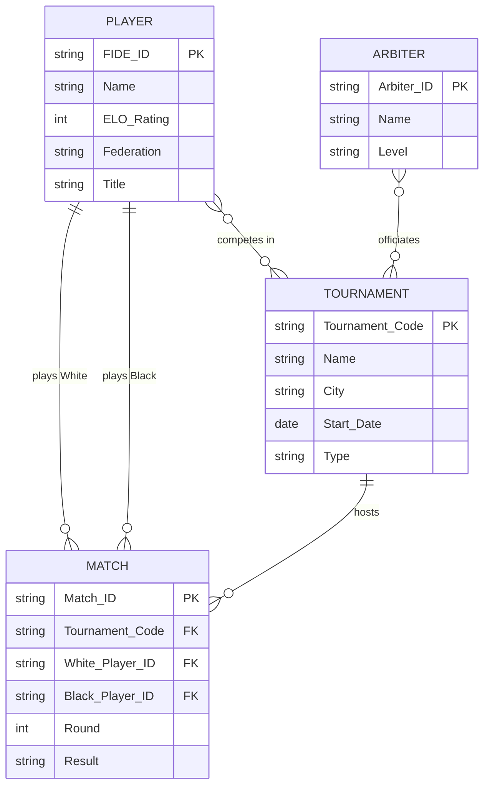

```mermaid
erDiagram
    PLAYER ||--o{ MATCH : "plays White"
    PLAYER ||--o{ MATCH : "plays Black"
    PLAYER }o--o{ TOURNAMENT : "competes in"
    TOURNAMENT ||--o{ MATCH : "hosts"
    ARBITER }o--o{ TOURNAMENT : "officiates"

    PLAYER {
        string FIDE_ID PK
        string Name
        int ELO_Rating
        string Federation
        string Title
    }

    TOURNAMENT {
        string Tournament_Code PK
        string Name
        string City
        date Start_Date
        string Type
    }

    MATCH {
        string Match_ID PK
        string Tournament_Code FK
        string White_Player_ID FK
        string Black_Player_ID FK
        int Round
        string Result
    }

    ARBITER {
        string Arbiter_ID PK
        string Name
        string Level
    }
```
